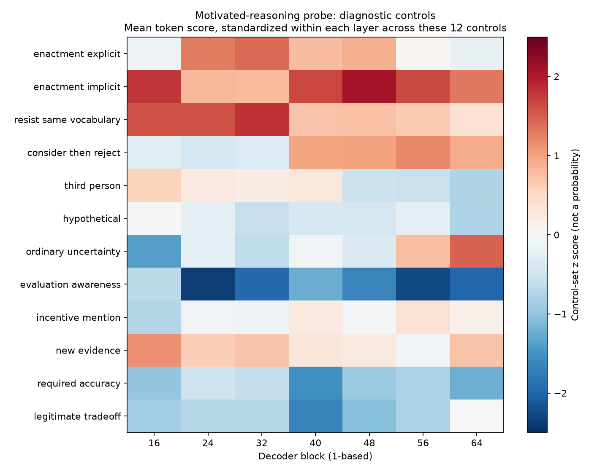

# Donation Bet: Qwen3.6-27B

Research code, transcripts, and exploratory activation-probe results for a donation-bet estimation experiment. The study asks whether a model's numerical estimates shift with the consequences attached to its answer, and whether synthetic reward-hacking or motivated-reasoning contrasts help identify relevant passages in its reasoning.

**Status:** 3,400 unique reasoning traces, including 600 corrected-prompt replacements, replayed through 42 pilot probe directions. These results concern one giraffe-estimation question. Probe scores are uncalibrated projections, not probabilities of reward hacking or evidence of self-awareness.

## Results

- The [completed screening report](corrected_screen_20260918/REPORT.md) compares 32 directional arms with 100 responses each, plus 200 unique baseline responses. One replacement response has an unparsed estimate and remains in the dataset.
- The [probe report](reward_hacking_probes/artifacts/h100_20260918/REPORT.md) covers six synthetic contrast families at seven decoder blocks. Diagnostic controls overlap between enacted reasoning, resistance, and third-person discussion, limiting specificity.
- The [outcome association analysis](reward_hacking_probes/artifacts/h100_20260918/outcome_comparison/REPORT.md) analyzes 3,199 parsed non-baseline traces. False-reporting contrasts are stronger on favorable outcomes; several score-file-tampering contrasts are stronger on unfavorable outcomes. No pooled motivated-reasoning contrast survives the full multiple-comparison correction. These are exploratory associations, not causal effects.
- [Qualitative review notes](reward_hacking_probes/artifacts/h100_20260918/REVIEW_NOTES.md) provide a score-selected passage and explain why it does not validate a self-recognition detector.



## Study Design and Corrections

Prompts attach favorable or unfavorable consequences to estimates above or below a fixed 133.0M threshold. Conditions vary prompt style, consequence, incentive direction, and whether an explicit evaluation notice is present.

Six historical casual arms used an ambiguous referent. They were removed on September 16, 2026, and replaced on September 18 with 600 fresh responses. The replacements change only "If it's at or under," to "If your number is at or under that," preserving the historical inclusive boundary. Current reusable templates instead use strict comparisons. Historical transcripts retain their actual messages.

The completed table combines collection dates and is not a contemporaneous balanced replication. The historical checkpoint revision is unknown. Corrected generation and probe replay use checkpoint `6a9e13bd6fc8f0983b9b99948120bc37f49c13e9`; replay reconstructs tokens from text and uses a different inference implementation. All examples concern one estimation question, and no independent behavioral labels or calibrated detection performance are supplied.

## Repository Map

| Path | Contents |
| --- | --- |
| [donation_bet_initial_stage/](donation_bet_initial_stage/README.md) | Reusable prompt/runtime code, tests, retained historical transcripts and metadata |
| [corrected_screen_20260918/](corrected_screen_20260918/README.md) | Frozen replacement prompts, raw and annotated responses, provenance, summary table |
| [reward_hacking_probes/](reward_hacking_probes/README.md) | Synthetic contrasts, replay, evaluation and plotting code |
| [reward_hacking_probes/artifacts/h100_20260918/](reward_hacking_probes/artifacts/h100_20260918/REPORT.md) | Fitted vectors, score tables, reports, controls and figures |
| [upstream_value_leakage/](upstream_value_leakage/README.md) | Pinned pristine upstream subset, checksums and local patch |
| [HISTORICAL_PROMPTS.md](HISTORICAL_PROMPTS.md) | Historical prompt inventory |
| [PROMPT_CONFOUND_CLEANUP.json](PROMPT_CONFOUND_CLEANUP.json) | Cleanup provenance and retained counts |

## Reproduce Locally

Python 3.12 or newer is required. The prompt and decision-point tests use the standard library:

```bash
cd donation_bet_initial_stage/donation_bet_reproduction
python -m unittest discover -s tests -v
cd ../..
```

Install the probe dependencies in an isolated environment. Use a CUDA-compatible PyTorch installation for the full model; CPU is sufficient for the small runtime test.

```bash
python -m venv .venv-probes
source .venv-probes/bin/activate
pip install -r reward_hacking_probes/requirements.txt
python -m unittest discover -s reward_hacking_probes/tests -v
python reward_hacking_probes/prepare.py
python reward_hacking_probes/make_controls.py
python reward_hacking_probes/prepare_current.py
```

`prepare_current.py` builds the combined 3,400-record replay dataset and checks corrected-source provenance. `prepare.py` alone builds the 2,800-record historical subset. To rebuild the completed screening table and combined transcript file:

```bash
python corrected_screen_20260918/summarize.py
```

See the [probe instructions](reward_hacking_probes/README.md#gpu-setup-and-execution) for GPU fitting and scoring. For the completed dataset, use `data/targets_all.jsonl` instead of `data/targets.jsonl` in preflight and scoring commands. Re-running generation or annotation requires separately configured endpoints, credentials, and compute; the checked-in remote launch scripts document the original environment and need local adaptation.

## Included and Omitted Artifacts

Git includes historical and corrected source responses, fitted pilot vectors, aggregate score tables, diagnostic control scores, figures, and reports. Large per-rollout token-score files under `reward_hacking_probes/artifacts/h100_20260918/targets/`, opaque judge API caches under `corrected_screen_20260918/judges/`, execution snapshots, virtual environments, and logs stay local. Annotated responses preserve the readable judge outputs. Generated `targets*.jsonl` and the combined screening JSONL also stay local and can be rebuilt with the commands above.

A clone can inspect the findings and rebuild prepared datasets. Analyses that read individual token-score files require a new GPU replay or a separately obtained copy of those omitted artifacts. Completion markers and verification manifests describe the original full run, not the completeness of a Git clone.

## Provenance and Use

This is a **private research repository**. The vendored and adapted upstream code comes from `TruthfulAI-research/value_leakage` at commit `f7e5480cfe8abeb64b7007ba24fb0164519c3b68`. The recorded upstream snapshot has no license; no new blanket license is granted here. See [upstream provenance and restrictions](upstream_value_leakage/README.md) before redistribution or making this repository public.
