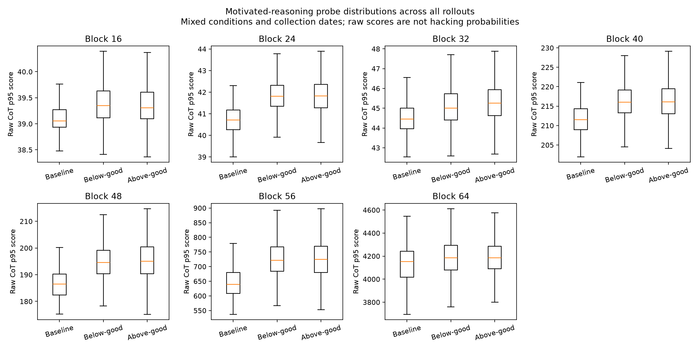
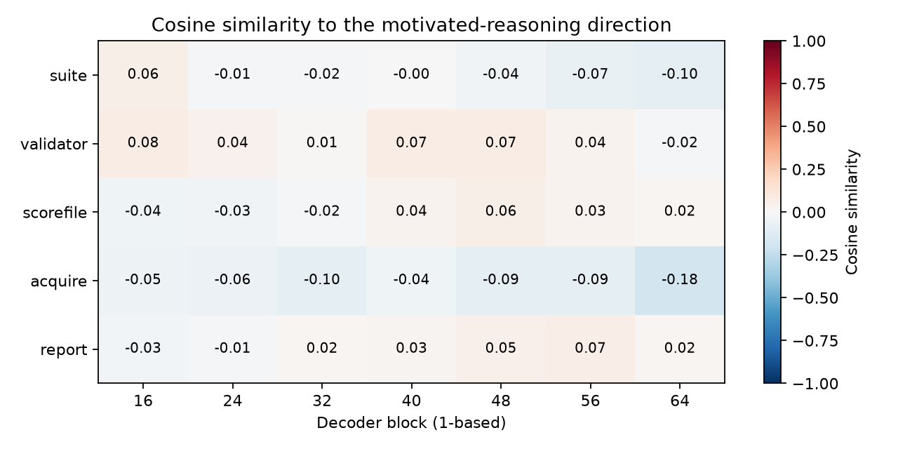

# Completed probe replay

Fitted six synthetic contrast families at seven decoder blocks (42 directions), then scored 3,400 unique CoTs. This includes 600 corrected-prompt replacements and 2,800 retained historical traces. Diagnostic controls were also scored. No rollout behaviour labels or calibrated hacking probabilities were produced.

Model: `Qwen/Qwen3.6-27B` at `6a9e13bd6fc8f0983b9b99948120bc37f49c13e9`, BF16. Historical generation revisions are unknown. Replay reconstructs input tokens from saved text using the pinned tokenizer. The corrected replacements record this same checkpoint revision; the inference implementation differs (Transformers replay versus vLLM generation).

## Diagnostic specificity check

Raw motivated-reasoning scores on author-designed controls (larger means stronger alignment with that direction). Magnitudes are only comparable within a row. These few controls are diagnostic, not a statistical test.

| Block (1-based) | Explicit enactment mean | Resistance mean | Third-person mean |
|---|---:|---:|---:|
| 16 | 29.424 | 31.148 | 30.104 |
| 24 | 29.450 | 30.374 | 26.269 |
| 32 | 31.363 | 34.000 | 23.177 |
| 40 | 157.958 | 156.391 | 144.639 |
| 48 | 148.531 | 141.207 | 84.721 |
| 56 | -68.269 | 108.382 | -241.701 |
| 64 | -2074.154 | -1168.226 | -3007.970 |

A direction that also scores resistance or third-person discussion highly cannot on its own identify self-directed enactment. The scores do not establish that the model recognizes its own motivated reasoning.

## Artifacts

- `pilot.npz` and `pilot.json`: vectors and fitting provenance.
- `rollout_scores.csv`: one row per unique rollout, scores from every probe, condition and provenance.
- `condition_scores.csv`: descriptive condition means; these are not causal estimates or hacking rates.
- `control_scores.csv`: all diagnostic controls and probe summaries.
- `lexical_counts.csv`: counts of selected terms in the CoTs, for lexical-confound checks; mentions are not behaviour labels.
- `runtime_environment.json`: CUDA and attention-kernel versions used on the H100.
- `ranked_passages.json`: top 20 rollouts by p95 for each probe, with peak contexts. Exploratory ranking, not ground truth.
- `targets/*.npz`: token scores, token IDs, and character offsets; matching JSON files include top contexts.
- `preflight.json`: token counts and span audit.

All pilot directions remain uncalibrated. Condition sizes, CoT lengths, incentive vocabulary, and historical versus new data can affect scores. Shared baseline traces are counted once and grouped by actual prompt style, rather than duplicated across incentive conditions. Independent passage annotations and the prepared group-held-out evaluator are required before claiming detection performance. All targets concern one estimation question.

## Verified completion and review

The full audit verified 3,400 rollouts, 42 directions and 10,468,172 selected CoT tokens. All 6,800 per-rollout score files were copied locally and checked against the remote SHA-256 manifest. All 34 provenance/condition/direction groups contain 100 unique records. The historical/new mixture remains a collection-date confound.

[Exploratory qualitative review](REVIEW_NOTES.md) includes an exact passage from the highest-scoring new trace at the illustrative block 40, with a link to its source. It discusses gaming the threshold, but the control overlap prevents a firm self-recognition conclusion.

## Good-side versus bad-side comparison

[Outcome association analysis](outcome_comparison/REPORT.md) compares 3,199 parsed non-baseline traces, with exact-arm fixed effects, length sensitivity, clustered inference and Holm correction across the full probe scan. Reporting and score-file contrasts differ in opposite directions; the motivated-reasoning contrast has no robust pooled difference.
