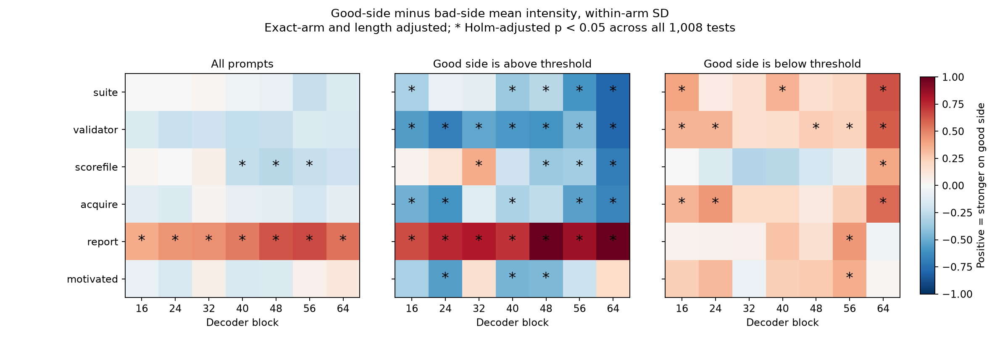

# Probe intensity versus good-side / bad-side outcome

**Yes, there are statistically significant associations, but no universal bad-side-higher pattern.** The reporting contrast is stronger on good-side outcomes. Several score-file-tampering directions are stronger on bad-side outcomes. The dedicated motivated-reasoning contrast has no pooled difference that survives the full multiple-comparison correction, though some direction-specific comparisons do.

Analyzed 3,199 non-baseline rollouts with parsed estimates: **1,879 good-side, 1,320 bad-side**. Excluded 200 distinct baseline traces from outcome comparison and one unparsed estimate. Good means strictly above the threshold in above-good arms, or at/below it in below-good arms. There are no threshold ties in these data. Good-side refers to the favoured consequence, not answer accuracy or reasoning quality.

## Representative pooled comparisons

Effects are **good minus bad**, adjusting for exact prompt arm and log CoT token count. Blocks are one-based. Intensity differences are divided by the pooled within-arm standard deviation. The displayed 95% intervals are pointwise, not simultaneous; the p-values use Holm family-wise correction across all **1,008** tested comparisons.

| Contrast / block | Mean intensity difference, within-arm SD [95% CI] | Adjusted p | Token-exceedance difference | Adjusted p |
|---|---:|---:|---:|---:|
| False reporting / 56 | +0.657 [+0.527, +0.787] | 1.5e-08 | +0.980 pp | 8.33e-08 |
| Score-file tampering / 48 | -0.280 [-0.361, -0.198] | 6.92e-05 | -0.869 pp | 1.54e-07 |
| Motivated reasoning / 40 | -0.155 [-0.320, +0.009] | 1 | -0.262 pp | 1 |

These are illustrative rows from the full scan, not independently selected confirmatory endpoints. All tested rows are in `tests.csv`. All seven reporting-contrast layers show higher pooled mean intensity on good-side outcomes after correction in the length-adjusted specification.

## What firing rate means here

No probe has a calibrated reward-hacking threshold. For an exploratory rate, each probe's cutoff is the **95th percentile of token scores in its style-matched unincentivized baseline** (100 paper-style and 100 casual-style baseline traces). Each rollout contributes its fraction of CoT tokens strictly exceeding that cutoff. The reference pools tokens, so long baseline traces contribute more tokens. Each target rollout has equal weight in the regression.

At that cutoff, **100% of the analyzed traces have at least one firing token for every probe**. Consequently, rollout-level any-fire rate cannot distinguish the groups. Token exceedance fractions can. For example, raw average fractions for reporting/block 56 are 4.96% good versus 4.13% bad; the adjusted difference is +0.98 percentage points. The primary table reports adjusted differences, not differences of the raw marginal averages.

A 99th-percentile baseline threshold was also tested and included in the same multiplicity correction. Neither cutoff is a calibrated false-positive rate for reward hacking, and uncertainty in estimating these baseline cutoffs is not propagated. Rate inference is conditional on the fixed baseline reference.

## Motivated-reasoning contrast

None of its seven layers has a significant pooled difference after correction across the full scan, for mean, p95, or either firing fraction in the length-adjusted specification. This does not establish equivalence or absence of an effect.

At block 40, **above-good prompts** show higher mean intensity on the bad side: good-minus-bad = -0.467 within-arm SD, adjusted p = 0.0025. The below-good estimate points in the opposite direction (+0.241 SD) but is not significant after correction. At block 56, the below-good mean-intensity comparison is significant (+0.362 SD, adjusted p = 0.00284). These are separate subgroup comparisons, not a formal interaction test.

The direction-specific pattern could partly track numerical magnitude, argument style, or related features of the estimate rather than good/bad outcome itself. Together with the previously observed enactment/resistance control overlap, this prevents a self-awareness interpretation.

## Statistical procedure and limits

- Exact-arm fixed effects: prompt key × incentive direction × provenance. Thirty-two arms, with 100 samples each except the arm with the unparsed estimate (99).
- Specifications with and without log CoT length; populations pooled, above-good, and below-good.
- Outcomes: mean token intensity, CoT p95 intensity, and token fractions above baseline 95th and 99th percentiles.
- CR1 sandwich standard errors clustered by arm, using Student-t critical values with G−1 degrees of freedom (31 pooled; 15 in each direction subgroup). This is approximate small-cluster inference.
- Holm correction across 42 probes × 4 summaries × 3 populations × 2 specifications = 1,008 tests. Both signs were tested. Full-design regressions independently reproduced the pooled representative coefficients and clustered p-values.
- Final-estimate side is an observed post-generation outcome. These are associations, not causal effects. Adjusting for length is a sensitivity specification and does not resolve that limitation. All data concern one estimation question, and six corrected arms were collected later.

Source score-table SHA-256: `1d6543c69375597aab8af44e5e6f29c010983223572fd05b04ed2a9c03bcebb9`.

